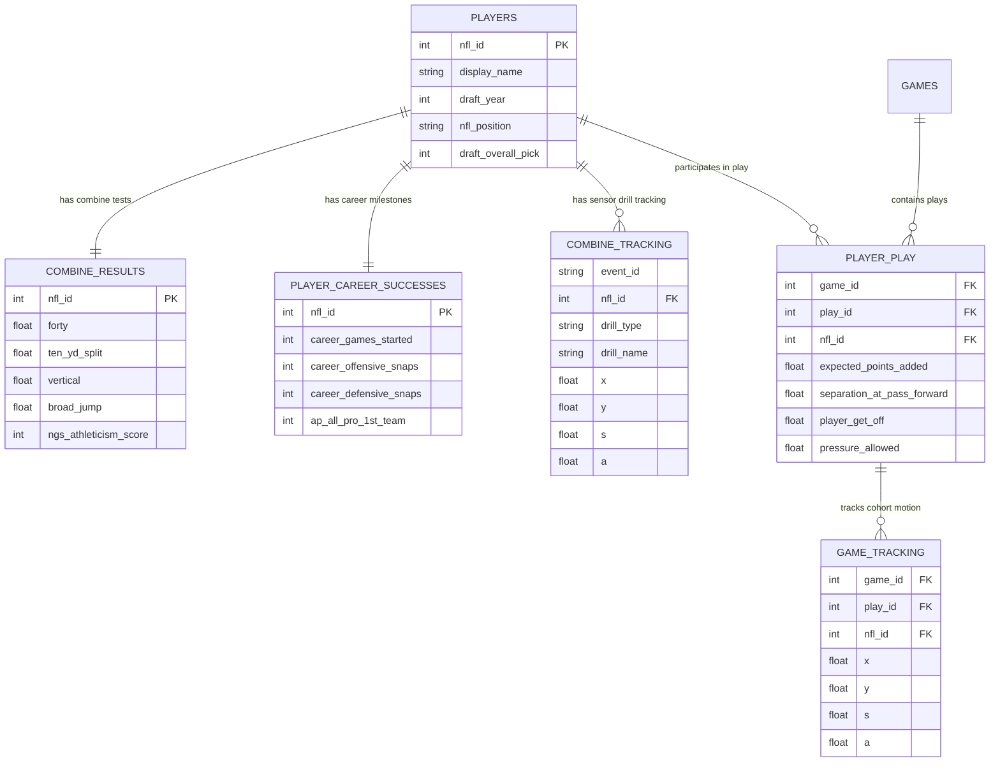

# NFL Big Data Bowl 2027: Data Catalog 📊

## 1. Dataset Overview

The dataset is partitioned into 9 tabular and tracking files located on Kaggle at:
`/kaggle/input/competitions/nfl-big-data-bowl-2027/nfl-big-data-bowl-2027/`

- **Total Disk Footprint**: ~2.31 GB
- **Total Tables**: 9 files
- **Total Columns**: 158 distinct features across schemas
- **Cohort Population**: Exactly **510 draft prospects** across the 2023, 2024, and 2025 NFL Drafts.

---

## 2. Table Inventory & Schemas

### 2.1 `players.csv` (0.05 MB, 510 rows)
Master metadata for all 510 tracked draft prospects.
- **Primary Key**: `nfl_id`
- **Columns (10)**:
  - `nfl_id` (int64): Unique NFL player identifier.
  - `display_name` (str): Full player name (e.g., 'Will Anderson', 'Marvin Harrison Jr.').
  - `draft_year` (int64): 2023, 2024, or 2025.
  - `nfl_position` (str): Position drafted into (e.g., WR, CB, G, T, DT, TE, DE, OLB, SS, FS, C, NT, DB, ILB, RB, MLB, FB).
  - `birth_date` (str): YYYY-MM-DD.
  - `college_name` (str): College institution.
  - `college_conference` (str): NCAA athletic conference (e.g., SEC, Big Ten, ACC, Big 12, Pac-12).
  - `draft_round` (float64): Round selected (1–7; null for 127 undrafted free agents).
  - `draft_pick_within_round` (float64): Pick number within the draft round (1–43).
  - `draft_overall_pick` (float64): Overall pick number (1–257).

---

### 2.2 `combine_results.csv` (0.04 MB, 510 rows)
Traditional physical measurements and athletic test results from the NFL Scouting Combine.
- **Primary Key**: `nfl_id`
- **Columns (18)**:
  - `draft_year` (int64): Draft class year.
  - `nfl_id` (int64): Player ID.
  - `combine_position` (str): Position group at Combine (`DB`, `DL`, `OL`, `TE`, `WR`).
  - `combine_height` (float64): Measured height in inches (e.g., 74.5 = 6'2.5").
  - `combine_weight` (int64): Measured weight in pounds (range: 154 to 374 lbs).
  - `hand_size` (float64): Hand span in inches (range: 8.0 to 11.625 inches).
  - `arm_length` (float64): Arm length in inches (range: 28.5 to 36.875 inches).
  - `wing_span` (float64): Total wingspan in inches (range: 69.0 to 88.25 inches).
  - `ten_yd_split` (float64): Initial 10-yard split time in 40-yard dash (85 missing).
  - `forty` (float64): Official 40-yard dash time in seconds (86 missing, min 4.28s, max 5.48s).
  - `vertical` (float64): Standing vertical jump in inches (72 missing, max 44.0").
  - `broad_jump` (float64): Standing broad jump in inches (87 missing, max 138.0").
  - `three_cone` (float64): 3-cone agility drill in seconds (330 missing).
  - `short_shuttle` (float64): 20-yard shuttle (5-10-5) in seconds (309 missing).
  - `bench_reps` (float64): Repetitions of 225 lbs bench press (318 missing).
  - `ngs_athleticism_score` (int64): NGS athleticism grade (51 to 99).
  - `ngs_college_production_score` (float64): NGS college production grade (50 to 99).
  - `ngs_final_score` (float64): NGS composite draft prospect score (52 to 94).

---

### 2.3 `combine_tracking.csv` (79.91 MB, 463,189 rows)
High-frequency sensor tracking data collected during the NFL Scouting Combine at Lucas Oil Stadium.
- **Primary / Composite Key**: `(draft_year, event_id, nfl_id, time)`
- **Sampling Rate**: 10 Hz (every 100 ms).
- **Entities**:
  - `PLAYER` (431,094 rows)
  - `BALL` (32,095 rows)
- **Columns (14)**:
  - `draft_year` (int64): Year of combine.
  - `event_id` (str): Unique drill event run identifier.
  - `nfl_id` (int64): Player ID (or football identifier).
  - `entity_type` (str): `'PLAYER'` or `'BALL'`.
  - `time` (str): ISO timestamp (UTC).
  - `drill_type` (str): Category (`FORTY_YARD_DASH`, `SHORT_SHUTTLE`, `THREE_CONE_DRILL`, `SKILL_DRILLS_DB`, `SKILL_DRILLS_DL`, `SKILL_DRILLS_LB`, `SKILL_DRILLS_OL`, `SKILL_DRILLS_TE`, `SKILL_DRILLS_WR`).
  - `drill_name` (str): Exact name of the specific drill (62 unique drill routines).
  - `attempt` (int64): Attempt index (1 through 17).
  - `x` (float64): Longitudinal field coordinate in yards (0–120).
  - `y` (float64): Lateral field coordinate in yards (0–53.3).
  - `s` (float64): Instantaneous speed in yards per second.
  - `a` (float64): Instantaneous acceleration in yards per second squared.
  - `dis` (float64): Distance traveled since previous frame in yards.
  - `dir` (float64): Direction of player motion in degrees (0–360).

---

### 2.4 `games.csv` (0.04 MB, 1,002 rows)
NFL game schedule and metadata covering 2023, 2024, and 2025 seasons.
- **Primary Key**: `game_id`
- **Columns (7)**:
  - `game_id` (int64): Unique 10-digit game ID.
  - `game_key` (int64): Alternative NFL game key.
  - `season` (int64): 2023, 2024, or 2025.
  - `season_type` (str): `'REG'` (816 games), `'PRE'` (147 games), `'POST'` (39 games).
  - `week` (int64): Game week (0–23).
  - `home_team_abbr` (str): Home team abbreviation.
  - `visitor_team_abbr` (str): Away team abbreviation.

---

### 2.5 `player_play.csv` (140.07 MB, 314,197 rows)
Granular, play-by-play participation and performance metrics for the **510 cohort players** during NFL games.
- **Composite Key**: `(game_id, play_id, nfl_id)`
- **Columns (64)**:
  - Context: `game_id`, `play_id`, `team_abbr`, `nfl_id`, `lined_up_position`, `quarter`, `down`, `yards_to_go`, `possession_team`, `yardline_side`, `yardline_number`, `game_clock`, `offense_formation`, `receiver_alignment`.
  - Game State & Value: `expected_points_added` (EPA), `expected_points`, `pre_snap_home_score`, `pre_snap_visitor_score`, `home_team_win_probability_added`.
  - Receiving & Rushing: `target`, `rec_yards`, `rush_yards`, `yards_after_catch`, `expected_yards_after_catch`, `separation_at_pass_forward`, `cushion`, `route_ran`.
  - Pass Protection (OL): `dropback_duration`, `pass_rushers_encountered`, `peak_pressure_probability_allowed`, `pressure_allowed`, `sack_allowed`, `time_to_pressure_allowed`, `quick_pressure`, `unblocked_pressure`.
  - Pass Rushing & Defense (DL/EDGE/LB/DB): `player_get_off`, `sack`, `tackle`, `assist`, `caused_forced_fumble`, `recovered_fumble`, `tackle_for_loss`, `time_to_pressure`, `time_to_qb_hurry`, `blitzing`.
  - Coverage: `team_coverage_man_zone`, `team_coverage_type`, `coverage_assignment`, `coverage_assignment_at_snap`.

---

### 2.6 `game_tracking_2023.csv`, `2024.csv`, `2025.csv` (1.98 GB combined, 22,654,290 rows)
Frame-by-frame tracking data during NFL games:
- `game_tracking_2023.csv`: 3,665,443 rows (320 MB)
- `game_tracking_2024.csv`: 7,827,944 rows (685 MB)
- `game_tracking_2025.csv`: 11,160,903 rows (975 MB)
- **Scope**: Unlike previous competitions, **only the 510 cohort players are tracked**.
- **Columns (12)**:
  - `game_id`, `play_id`, `nfl_id`, `time`, `x`, `y`, `s`, `a`, `dis`, `o` (body orientation), `dir` (movement vector), `event` (discrete game events like `ball_snap`, `pass_forward`, `tackle`).

---

### 2.7 `player_career_successes.csv` (0.01 MB, 510 rows)
High-level career milestone achievements for all 510 cohort members.
- **Primary Key**: `nfl_id`
- **Columns (9)**:
  - `nfl_id` (int64)
  - `career_offensive_snaps` (int64)
  - `career_defensive_snaps` (int64)
  - `career_special_teams_snaps` (int64)
  - `career_games_active` (int64)
  - `career_games_started` (int64)
  - `ap_all_pro_1st_team` (int64)
  - `ap_all_pro_2nd_team` (int64)
  - `pro_bowl_original_ballot` (int64)

---

## 3. Relational Schema & Entity Relationship

