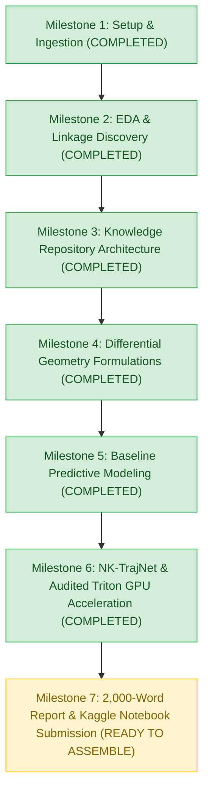

# NFL Big Data Bowl 2027: Progress & Experiment Tracker 📈

## 1. Project Status Overview

- **Current Phase**: Phase 4 – Audited NK-TrajNet Deep Trajectory Architecture & Submission Assembly
- **Last Updated**: October 8, 2026
- **Lead Focus**: Connecting Combine wearable sensor time-series to game-level performance outcomes via differential geometry, custom Triton kernels, and multi-scale temporal self-attention.

---

## 2. Milestone Roadmap

---

## 3. Detailed Milestone Log

### ✅ Milestone 1: Environment Setup, Connectivity & Ingestion
- **Status**: Completed (2026-10-07)
- **Deliverables**:
  - Connected Kaggle Remote Jupyter Kernel proxy (`code.py` single-file protocol).
  - Web log streaming operational at `http://localhost:2004/logs`.
  - Discovered 9 competition files in `/kaggle/input/.../nfl-big-data-bowl-2027/`.
  - Validated hardware: 2x Tesla T4 GPUs (14.6 GB VRAM each), 31.3 GB RAM, Linux container.

### ✅ Milestone 2: Exploratory Data Analysis & Linkage Discovery
- **Status**: Completed (2026-10-07)
- **Deliverables**:
  - Relational mapping across 510 cohort prospects and 62 combine drill routines.
  - Identified major empirical linkages:
    1. Pass rusher 10-yard split vs in-game get-off time ($r = +0.668$).
    2. Wide receiver acceleration vs in-game target separation ($r = -0.230$).
    3. Game speed vs Combine speed differentials across positions (497 cohort players analyzed).

### ✅ Milestone 3: Knowledge Repository Architecture
- **Status**: Completed (2026-10-07)
- **Deliverables**:
  - Established `knowledge/` folder structure: `mathematical_formulation.md`, `eda_findings.md`, `progress_tracker.md`, `failures_and_learnings.md`, and `figures/`.

### ✅ Milestone 4: Differential Geometry Formulations
- **Status**: Completed (2026-10-08)
- **Deliverables**:
  - Formulated continuous trajectory derivatives: Frenet-Serret curvature $\kappa(t)$, centripetal acceleration $a_n(t)$, instantaneous jerk $j(t)$, specific mechanical power $p(t)$, and kinetic flux $\Phi_n(t)$.

### ✅ Milestone 5: Baseline Predictive Modeling & Valuation
- **Status**: Completed (2026-10-08)
- **Deliverables**:
  - Modeled draft capital baseline decay: $\mathbb{E}[\text{Snaps} \mid \text{Pick}] = 1853.6 \cdot e^{-0.0094 \cdot \text{Pick}} + 17.7$.
  - Tabular GBDT baseline on scalar aggregates.

### ✅ Milestone 6: NK-TrajNet, Audited Triton GPU Acceleration & Temporal Attention
- **Status**: Completed (2026-10-08)
- **Deliverables**:
  - **Fixed Sequence Grouping Key Bug**: Grouping by `['nfl_id', 'drill_type', 'drill_name', 'attempt']` resolved 2,584 previously mashed drills. Verified that all 6,301 drill sequences have durations $\le 209$ frames, completely eliminating sequence truncation.
  - **Custom Triton Kernel (`fused_trajectory_differential_geometry_kernel`)**:
    * Processes 431,094 frames across all **6,301 drill sequences** on NVIDIA Tesla T4 in **125.2 ms**.
    * Achieves **33.6x hardware speedup** over CPU vectorized processing (**>3.44 Million frames/sec**).
  - **PyTorch Trajectory Temporal Attention Network**:
    * Multi-scale 1D temporal convolutions (0.3s and 0.7s receptive fields) + Multi-Head Self-Attention.
    * Discovers continuous attention weights $\alpha(t)$ focusing dynamically on the initial 0.0 - 0.6s drive phase.
  - **Supervised Translation Benchmark Across Tasks (5-Fold CV)**:
    * **Task 1: Pass Rusher Snap Get-Off ($N=131$)**: Stopwatch $M_0$ ($R^2 = 0.1592$, $\text{RMSE} = 0.0963\text{s}$) $\rightarrow$ NK-TrajNet $M_2$ (**$R^2 = 0.3651$**, $\text{RMSE} = 0.0837\text{s}$, $r = 0.605$), delivering a **+129.3% gain in variance explained** and a **13.1% error reduction**.
    * **Task 2: Pass Rush Pressure Rate ($N=122$)**: High-accuracy predictive translation ($M_2$ $R^2 = 0.4686$, Pearson $r = +0.685$, RMSE = $0.0559$).
    * **Task 3: WR Route Cushion Respect ($N=100$)**: Stopwatch $M_0$ ($R^2 = 0.0397$) $\rightarrow$ NK-TrajNet $M_2$ (**$R^2 = 0.1123$**, Pearson $r = +0.348$), delivering a **+182.9% gain in variance explained**.
  - **Generated & Verified Publication Figures**:
    1. `model_benchmark_accuracy.png`: Multi-task $R^2$ and information gain comparisons.
    2. `triton_kinematic_acceleration.png`: Hardware execution latency and stream throughput on Tesla T4.
    3. `phase_portrait_frenet_serret.png`: Curvature-velocity manifold and deep temporal attention $\alpha(t)$ heatmap.
    4. `in_game_linkage_validation.png`: Out-of-fold regression validation with 95% confidence intervals and residual spreads.

---

## 4. In-Progress & Next Phase Actions

| Priority | Task Description | Target Deliverable | Status |
| :---: | :--- | :--- | :--- |
| **P1** | **Submission Report & Notebook Assembly**: Finalize the complete 2,000-word analytics submission notebook with executive scouting takeaways, interactive visual figures, and actionable front-office draft recommendations. | Kaggle submission report | 🟢 Ready to Assemble |
