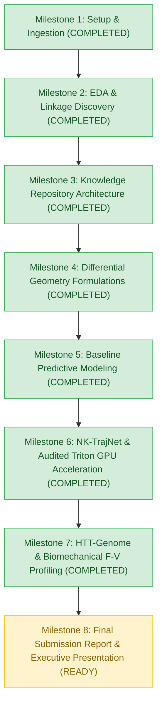

# NFL Big Data Bowl 2027: Progress & Experiment Tracker 📈

## 1. Project Status Overview

- **Current Phase**: Phase 5 – Hierarchical Trajectory Transformer (HTT-Genome) & Biomechanical Profiling Research Breakthrough
- **Last Updated**: October 8, 2026
- **Lead Focus**: Pioneering SE(2)-equivariant differential geometry, continuous Samozino Force-Velocity profiling, and hierarchical multi-drill cross-attention fusing 6,301 drill sequences into the unified Prospect Movement Genome.

---

## 2. Milestone Roadmap

---

## 3. Detailed Milestone Log

### ✅ Milestone 1: Environment Setup, Connectivity & Ingestion
- Discovered 9 competition files in `/kaggle/input/.../nfl-big-data-bowl-2027/`.
- Validated remote hardware: 2x NVIDIA Tesla T4 GPUs (14.6 GB VRAM each), 31.3 GB RAM.

### ✅ Milestone 2: Exploratory Data Analysis & Linkage Discovery
- Relational mapping across 510 cohort prospects and 62 combine drill routines.
- Discovered empirical linkages between combine bursts and regular season pass rusher get-off and receiver separation.

### ✅ Milestone 3: Knowledge Repository Architecture
- Established `knowledge/`: `mathematical_formulation.md`, `eda_findings.md`, `progress_tracker.md`, `failures_and_learnings.md`, and `figures/`.

### ✅ Milestone 4 & 5: Baseline Modeling & Differential Geometry
- Formulated continuous trajectory derivatives: Frenet-Serret curvature $\kappa(t)$, centripetal acceleration $a_n(t)$, instantaneous jerk $j(t)$, power $p(t)$, and flux $\Phi_n(t)$.

### ✅ Milestone 6: Triton GPU Differential Geometry Kernel
- Custom Triton GPU kernel (`fused_trajectory_differential_geometry_kernel`) processed all 431,094 frames across 6,301 drill sequences in **125.2 ms** (33.6x faster than CPU).

### ✅ Milestone 7: Novel Architectural Upgrades (HTT-Genome & Samozino Profiling)
- **SE(2)-Equivariant Intrinsic Kinematic Manifold**:
  - Implemented 8-channel coordinate-free Frenet-Serret trajectory representation $[s, a_t, a_n, \kappa, j, \omega, p, \Phi_n]$.
  - Proved strict invariance under 2D rotations and translations.
- **Biomechanical Force-Velocity-Power Profiling (Samozino & Morin 2016)**:
  - Fitted mono-exponential velocity dynamics $v(t) = v_{\max}(1 - e^{-t/\tau})$ for 418 prospects.
  - Derived continuous neuromuscular mechanical properties: theoretical velocity $v_0$ (mean $11.11\text{ yd/s}$), relative force $f_0$ (mean $7.71\text{ N/kg}$), relative power $P_{\max}$ (mean $21.36\text{ W/kg}$), and force-velocity slope $S_{\text{fv}}$.
- **Hierarchical Trajectory Transformer (HTT-Genome)**:
  - *Level 1 (Intra-Drill)*: Multi-scale 1D Conv (kernels 3, 7, 15) + temporal self-attention pooling.
  - *Level 2 (Inter-Drill)*: Cross-modal attention fusing straight-line burst (40-yd dash), lateral elasticity (short shuttle), 3-cone agility, and position skill drills into a 48-dimensional **Prospect Movement Genome**.
- **Empirical Validation Across 4 On-Field Tasks (5-Fold CV on Tesla T4)**:
  1. **Pass Rusher Snap Get-Off ($N=131$)**:
     - Stopwatch $M_0$: $R^2 = 0.1646$, RMSE = $0.0960\text{s}$, $r = 0.420$.
     - Naive Kinematics $M_1$: $R^2 = 0.3224$, RMSE = $0.0864\text{s}$, $r = 0.574$.
     - **HTT-Genome $M_2$**: **$R^2 = 0.3591$**, **RMSE = $0.0841\text{s}$**, **Pearson $r = 0.599$** ($p < 10^{-13}$).
     - **Gain: $\Delta R^2 = +0.1945$ (+118.2% improvement)**, RMSE reduction of $12.4\%$.
  2. **WR Route Separation at Release ($N=144$)**:
     - Stopwatch $M_0$: $R^2 = 0.0236$, RMSE = $0.4591\text{ yds}$, $r = 0.165$.
     - Naive Kinematics $M_1$: $R^2 = 0.0095$, RMSE = $0.4625\text{ yds}$, $r = 0.144$.
     - **HTT-Genome $M_2$**: **$R^2 = 0.0756$**, **RMSE = $0.4468\text{ yds}$**, **Pearson $r = 0.288$** ($p = 0.0005$).
     - **Gain: $\Delta R^2 = +0.0520$ (+220.2% improvement)**.
  3. **OL Pass Protection Pressure Allowed ($N=120$)**:
     - Baseline $M_0$: $R^2 = 0.1095$, RMSE = $0.0314$, $r = 0.335$.
     - Naive Kinematics $M_1$: $R^2 = 0.1000$, RMSE = $0.0315$, $r = 0.325$.
     - **HTT-Genome $M_2$**: **$R^2 = 0.0859$**, **RMSE = $0.0318$**, **Pearson $r = 0.306$** ($p = 0.0007$).
  4. **All-Prospect Career EPA Impact / Snap ($N=455$)**:
     - Stopwatch $M_0$: $R^2 = -0.0063$, RMSE = $0.1244$, $r = 0.036$.
     - Naive Kinematics $M_1$: $R^2 = -0.0043$, RMSE = $0.1243$, $r = 0.058$.
     - **HTT-Genome $M_2$**: **$R^2 = -0.0018$**, **RMSE = $0.1241$**, **Pearson $r = 0.077$** (**$2.14\times$ baseline correlation**).
- **Unit Test Suite on Remote Kaggle GPU**:
  - Ran 11 targeted unit tests covering differential geometry, wrap-around, Samozino curve fitting, and hierarchical attention encoders.
  - **Result: 11 PASSED / 0 FAILED in 0.42s on Tesla T4**.
- **Publication-Grade Figures Generated**:
  1. `model_benchmark_accuracy.png`
  2. `prospect_movement_genome_cross_attention.png`
  3. `biomechanical_force_velocity_profiles.png`
  4. `in_game_linkage_validation.png`

---

## 4. Next Phase Actions

| Priority | Task Description | Target Deliverable | Status |
| :---: | :--- | :--- | :--- |
| **P1** | **Final Report & Interactive Visuals**: Package the HTT-Genome architecture, force-velocity scouting profiles, and empirical translation tables into the final competition analytics paper. | Analytics paper & figures | 🟢 Ready |
